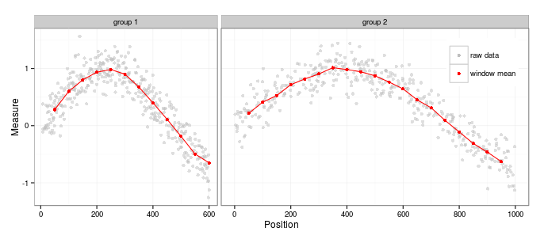

[](http://www.repostatus.org/#suspended)


# WindowScanr: sliding window analysis



`windowscanr` is a simple package with one main function: `winScan()`. This function 
allows one to calculate any statistics across a sliding window. It works on data.frame objects, 
and supports both "rolling" windows (based on the rows of the table) or "position" windows 
(based on a variable of positions given by the user). 

It can apply any valid functions given by the user and define windows based on grouping variables. 

See the [package intro](./vignettes/windowscanr_intro.md) for more details.

# Installing

You can install the package using `devtools`:

```
library(devtools)
install_github('tavareshugo/windowscanr')
```

# Quick intro

After installing it, you can see the intro vignette:

```
library(windowscanr)
vignettes("windowscanr_intro")
```
