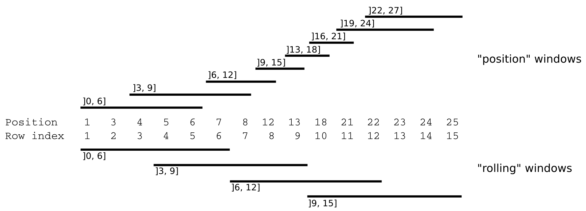
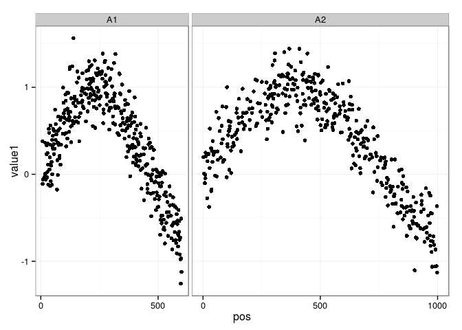
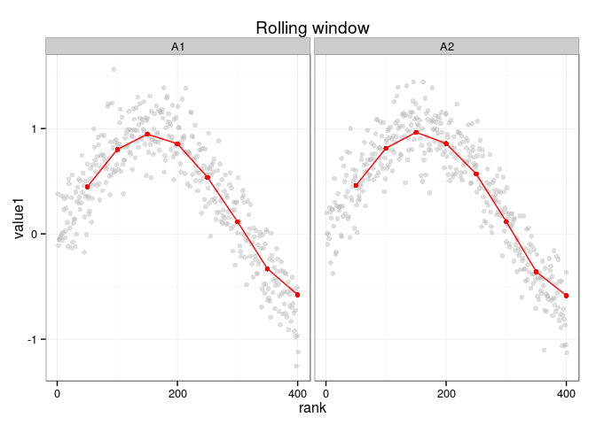
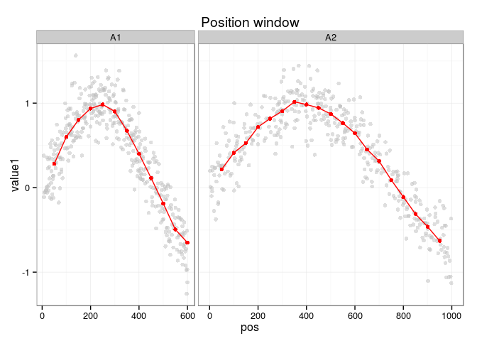
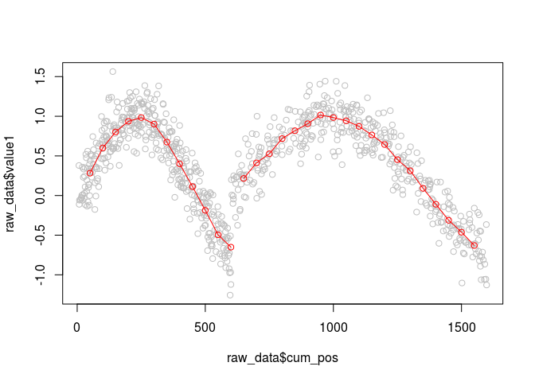

# `windowscanr` package intro
Hugo Tavares  
29 January 2016  

<!--
%\VignetteEngine{knitr::rmarkdown}
%\VignetteIndexEntry{windowscanr intro}
%\VignetteDepends{windowscanr}
-->

`windowscanr` is a simple package with one main function: `winScan()`. This function 
allows one to calculate any statistics across a sliding window. It works on data.frame objects, 
and supports both "rolling" windows (simply based on the rows of the table) or "position" windows 
(based on a variable of positions given by the user). 



It can apply any valid functions given by 
the user and calculate windows based on grouping variables. 
This allows for great flexibility, and it's up to the user to specify functions that work for 
the intended purpose. These functions have to take as a first argument a vector and return a single
value (custom examples will be included in future versions of this vignette). 

This package was written thinking of genomic data, where one tipically has data from several _bases_
across the genome (position variable) and for several _chromosomes_ (group variable). However, the 
package is agnostic as to which type of data is used. Here, a generic example is considered.

# Simulated example data

The code below generates a data.frame with a group variable containing two levels ("A1" and "A2"),  
a position variable (which varies between 1-600 for "A1" and 1-1000 for the "A2" group).
Finally, there are two variables containing values on which we want to apply our functions. The 
"value1" variable has a peak for illustration purposes.


```r
# Load packages
library(dplyr)
library(tidyr)
library(ggplot2); theme_set(theme_bw())
library(windowscanr)

## Simulate the data
set.seed(1)
group <- rep(c("A1", "A2"), each = 401)
pos <- c(sort(sample(1:600, 401)), sort(sample(1:1000, 401)))
value1 <- c(sin(seq(0, 4, 0.01)), sin(seq(0, 4, 0.01))) + rnorm(802, 0, 0.2)
value2 <- rnorm(802)

raw_data <- data.frame(group, pos, value1, value2)

head(raw_data)
```

```
##   group pos      value1     value2
## 1    A1   7  0.37913095 -2.1061184
## 2    A1   8 -0.11059963  0.6976485
## 3    A1   9 -0.05817490  0.9074444
## 4    A1  13 -0.05324891 -0.1959882
## 5    A1  16 -0.03514215 -0.2068205
## 6    A1  17 -0.02334702  0.7250432
```

This is how the raw data looks like for the _value1_ variable:


```r
ggplot(raw_data, aes(pos, value1)) + geom_point() + 
	facet_grid(~ group, scales = "free_x", space = "free_x") +
	scale_x_continuous(breaks = seq(0, 5000, 500))
```

<!-- -->


# "Rolling" windows

First, we apply functions over "rolling" windows, that is, we ignore the position variable and the sliding windows
will be based on the rows of the table. In this case, we will make windows with size 100,000 and step 50,000. 
Therefore, each window will contain 100,000 rows of our table.

We will apply two functions to our data: `mean()` and `sd()`. Each of these function will be applied to two 
variables: `value1` and `value2`.


```r
rol_win <- winScan(x = raw_data, 
					 groups = "group", 
					 position = NULL, 
					 values = c("value1", "value2"), 
					 win_size = 100,
					 win_step = 50,
					 funs = c("mean", "sd"))

head(rol_win)
```

```
##   group win_start win_end win_mid value1_n value1_mean value1_sd value2_n
## 1    A1         0     100      50      100   0.4456654 0.3489837      100
## 2    A1        50     150     100      100   0.8015206 0.2740447      100
## 3    A1       100     200     150      100   0.9463614 0.2020410      100
## 4    A1       150     250     200      100   0.8553101 0.2531241      100
## 5    A1       200     300     250      100   0.5370328 0.3267499      100
## 6    A1       250     350     300      100   0.1154547 0.3407793      100
##   value2_mean value2_sd
## 1  0.26444531 1.0406281
## 2  0.07934470 0.9995369
## 3 -0.16568976 0.8629227
## 4 -0.01808501 1.0150294
## 5  0.07163776 1.0382457
## 6  0.03744753 0.9825178
```

Notice that to calculate a "rolling" window, we need only specify `position = NULL`.
Also notice that column names have the original name, followed by the name of the function 
that was applied.

The result for `value1_mean` looks like this:


```r
# Add "rank" variable for each group
# in this case this is equivalent to c(1:401, 1:401)
raw_data <- raw_data %>%
	group_by(group) %>%
	mutate(rank = 1:n()) %>%
	as.data.frame()

# Make the plot
ggplot(raw_data, aes(rank, value1)) + geom_point(alpha = 0.5, colour = "grey") +
	geom_point(data = rol_win, aes(win_mid, value1_mean), colour = "red") +
	geom_line(data = rol_win, aes(win_mid, value1_mean), colour = "red") +
	facet_grid(~ group, scales = "free_x", space = "free_x") +
	scale_x_continuous(breaks = seq(0, 1000, 200)) + 
	ggtitle("Rolling window")
```

<!-- -->


# "Position" windows

To make position-based windows we need only specific the position variable from our table:


```r
pos_win <- winScan(x = raw_data, 
					 groups = "group", 
					 position = "pos", 
					 values = c("value1", "value2"), 
					 win_size = 100,
					 win_step = 50,
					 funs = c("mean", "sd"))

head(pos_win)
```

```
##   group win_start win_end win_mid value1_n value1_mean value1_sd value2_n
## 1    A1         0     100      50       65   0.2822598 0.2709174       65
## 2    A1        50     150     100       68   0.6013252 0.2982342       68
## 3    A1       100     200     150       65   0.8023547 0.2410303       65
## 4    A1       150     250     200       68   0.9366394 0.1955273       68
## 5    A1       200     300     250       69   0.9834426 0.1967566       69
## 6    A1       250     350     300       63   0.9016697 0.2369854       63
##   value2_mean value2_sd
## 1  0.08278253 0.9924010
## 2  0.23643837 1.0939588
## 3  0.24736182 1.0452004
## 4 -0.26892760 0.8755836
## 5 -0.16378668 0.8691124
## 6  0.17914401 0.9006059
```

The result looks like this:


```r
ggplot(raw_data, aes(pos, value1)) + geom_point(alpha = 0.5, colour = "grey") + 
	geom_point(data = pos_win, aes(win_mid, value1_mean), colour = "red") +
	geom_line(data = pos_win, aes(win_mid, value1_mean), colour = "red") +
	facet_grid(~ group, scales = "free_x", space = "free_x") +
	scale_x_continuous(breaks = seq(0, 1000, 200)) + 
	ggtitle("Position window")
```

<!-- -->

The difference between the two window approaches is clear from the plots. 

Whereas "rolling" windows have the same number of observations in each window (100 in this case), 
the "position" windows might vary:


```r
table(rol_win$value1_n)
```

```
## 
##  51 100 
##   2  14
```

```r
table(pos_win$value1_n)
```

```
## 
## 27 33 35 36 38 39 40 41 42 43 45 63 65 68 69 70 
##  1  1  1  2  1  3  2  1  1  4  3  2  3  2  3  1
```

Note that, in fact, some windows in the "rolling" window have half the number of observations. These are the last 
windows in each group, which do not always end at the last position of the data (this  because the length of the data 
is not always divisible by the length of the window). Therefore, interpretation of the last window in each group should
be taken with care.


# Cumulative positions for plotting

In the above example, we used the `facet_grid()` function from `ggplot2` to separate
each of our groups in the plot. However, there is also the possibility of plotting
all points next to each other on a "cumulative" scale. 
The function `cumSumGroup()` allows to easily do this (currently it only works
with one group). This is different from the base function `cumsum()`, in that
the cumulative position is calculated _across_ groups and not _within_ groups (see
example in `?cumSumGroup` for the difference).

Here is an alternative way of plotting the data, using the base `plot()` function 
together with `cumSumGroup()`.


```r
# Add variable with cumulative position
raw_data$cum_pos <- cumSumGroup(raw_data$pos, raw_data$group)
pos_win$cum_mid <- cumSumGroup(pos_win$win_mid, pos_win$group)

# Make plot
plot(raw_data$cum_pos, raw_data$value1, col = "grey")
for(i in unique(pos_win$group)){
	i <- which(pos_win$group == i)
	points(pos_win$cum_mid[i], pos_win$value1_mean[i], col = "red")
	lines(pos_win$cum_mid[i], pos_win$value1_mean[i], col = "red")
	rm(i)
}
```

<!-- -->


# Parallel processing

The `winScan()` function supports the use of multiple cores for parallel processing window calculations. 
To do so, simply pass the number of cores to use to the `cores` argument in the `winScan()` function.
Unfortunately, this is not supported on Windows machines (because of the use of the `mcapply()` function 
from the `parallel` package). This might be fixed in the future by using the 
[BiocParallel](https://bioconductor.org/packages/devel/bioc/html/BiocParallel.html) 
package instead.


